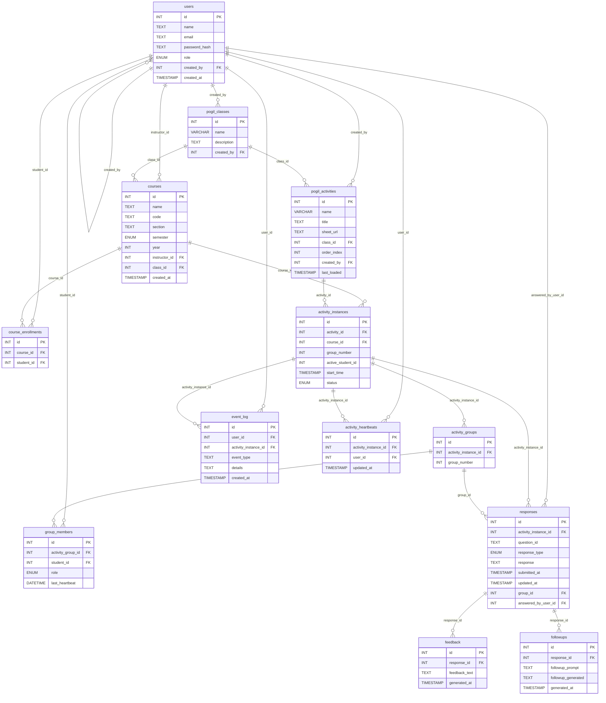

```mermaid
erDiagram

  users {
    INT id PK
    TEXT name
    TEXT email
    TEXT password_hash
    ENUM role
    INT created_by FK
    TIMESTAMP created_at
  }

  pogil_classes {
    INT id PK
    VARCHAR name
    TEXT description
    INT created_by FK
  }

  courses {
    INT id PK
    TEXT name
    TEXT code
    TEXT section
    ENUM semester
    INT year
    INT instructor_id FK
    INT class_id FK
    TIMESTAMP created_at
  }

  course_enrollments {
    INT id PK
    INT course_id FK
    INT student_id FK
  }

  pogil_activities {
    INT id PK
    VARCHAR name
    TEXT title
    TEXT sheet_url
    INT class_id FK
    INT order_index
    INT created_by FK
    TIMESTAMP last_loaded
  }

  activity_instances {
    INT id PK
    INT activity_id FK
    INT course_id FK
    INT group_number
    INT active_student_id
    TIMESTAMP start_time
    ENUM status
  }

  activity_groups {
    INT id PK
    INT activity_instance_id FK
    INT group_number
  }

  group_members {
    INT id PK
    INT activity_group_id FK
    INT student_id FK
    ENUM role
    DATETIME last_heartbeat
  }

  responses {
    INT id PK
    INT activity_instance_id FK
    TEXT question_id
    ENUM response_type
    TEXT response
    TIMESTAMP submitted_at
    TIMESTAMP updated_at
    INT group_id FK
    INT answered_by_user_id FK
  }

  feedback {
    INT id PK
    INT response_id FK
    TEXT feedback_text
    TIMESTAMP generated_at
  }

  followups {
    INT id PK
    INT response_id FK
    TEXT followup_prompt
    TEXT followup_generated
    TIMESTAMP generated_at
  }

  event_log {
    INT id PK
    INT user_id FK
    INT activity_instance_id FK
    TEXT event_type
    TEXT details
    TIMESTAMP created_at
  }

  activity_heartbeats {
    INT id PK
    INT activity_instance_id FK
    INT user_id FK
    TIMESTAMP updated_at
  }

  %% Relationships

  users ||--o{ users : created_by
  users ||--o{ pogil_classes : created_by
  users ||--o{ courses : instructor_id
  users ||--o{ course_enrollments : student_id
  users ||--o{ pogil_activities : created_by
  users ||--o{ group_members : student_id
  users ||--o{ responses : answered_by_user_id
  users ||--o{ event_log : user_id
  users ||--o{ activity_heartbeats : user_id

  pogil_classes ||--o{ courses : class_id
  pogil_classes ||--o{ pogil_activities : class_id

  courses ||--o{ course_enrollments : course_id
  courses ||--o{ activity_instances : course_id

  pogil_activities ||--o{ activity_instances : activity_id

  activity_instances ||--o{ activity_groups : activity_instance_id
  activity_instances ||--o{ responses : activity_instance_id
  activity_instances ||--o{ event_log : activity_instance_id
  activity_instances ||--o{ activity_heartbeats : activity_instance_id

  activity_groups ||--o{ group_members : activity_group_id
  activity_groups ||--o{ responses : group_id

  responses ||--o{ feedback : response_id
  responses ||--o{ followups : response_id
```
